= Gerrit Trigger Plugin

image:https://img.shields.io/jenkins/plugin/v/gerrit-trigger.svg[link="https://plugins.jenkins.io/gerrit-trigger"]
image:https://img.shields.io/github/release/jenkinsci/gerrit-trigger-plugin.svg?label=changelog[link="https://github.com/jenkinsci/gerrit-trigger-plugin/releases/latest"]
image:https://img.shields.io/jenkins/plugin/i/gerrit-trigger.svg?color=blue[link="https://plugins.jenkins.io/gerrit-trigger"]

This plugin integrates Jenkins to
http://code.google.com/p/gerrit/[Gerrit code review] for triggering
builds when a "patch set" is created.

[NOTE]
====
Older versions of this plugin may not be safe to use. Please review the
following warnings before using an older version:

 * https://jenkins.io/security/advisory/2018-02-26/#SECURITY-402[Unauthorized
access to some Gerrit Trigger server configuration]
* https://jenkins.io/security/advisory/2018-02-26/#SECURITY-403[Unauthorized
users were able to change Gerrit Trigger server configuration]
====

== Set Up

=== Gerrit access rights

. Create the profile through in _Gerrit web interface_ for your Jenkins
user, and set up a _SSH key_ for that user.
. Gerrit web interface > Admin > Groups > Non-Interactive Users > Add
your jenkins user.
. Admin > Projects > ... > Access > Edit
* Reference: `+refs/*+`
** *Read*: ALLOW for Non-Interactive Users
* Reference: `+refs/heads/*+`
** *Label Code-Review*: -1, +1 for Non-Interactive Users
** *Label Verified*: -1, +1 for Non-Interactive Users

Gerrit documentation:
http://gerrit-documentation.googlecode.com/svn/Documentation/2.4.2/access-control.html#examples_cisystem

*IMPORTANT:* On Gerrit 2.7+, you also need to grant "Stream Events"
capability. Without this, the plugin will not work, will try to connect
to Gerrit repeatedly, and will eventually cause OutOfMemoryError on
Gerrit.

. Gerrit web interface > People > Create New Group : "Event Streaming
Users". Add your jenkins user.
. Admin > Projects > All-Projects > Access > Edit

* {blank}
** *Global Capabilities*
*** *Stream Events:* ALLOW for Event Streaming Users

https://gerrit-documentation.googlecode.com/svn/Documentation/2.7/access-control.html#capability_streamEvents

=== Administrative Settings

Specify the Gerrit server settings via "Manage Jenkins > Gerrit Trigger"

Fill in the server settings:

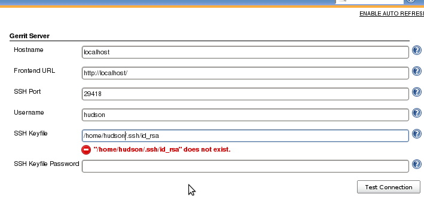

Click "Test Connection" to verify the connection.

When everything seems ok, save your settings and restart the connection
in the "Control" section at the bottom of the page:

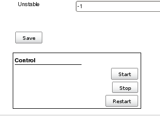

There are many more settings for your pleasure, look at the individual
help sections for information what they are about.

=== Trigger Configuration

In the "Build Triggers" section of your Job configuration page; tick
"Gerrit event":

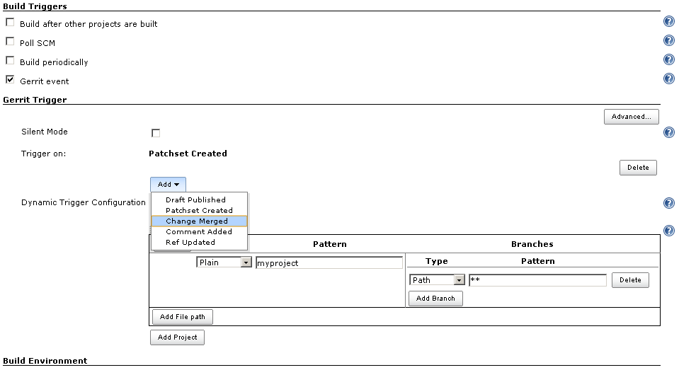

Specify what type of event(s) to trigger on:

* *Draft Published:* Sent when a change moves from draft state to new.
(only available in version 2.5 or higher of Gerrit).
* *Patchset Created:* Sent when a new patchset arrives on a change.
Before version 2.6.0, this was the only event you could trigger on.
* *Change Merged:* Sent when a change is merged on the Gerrit server.
* *Comment Added:* Sent when a comment is added to a change. Which
category and value to trigger on can be configured. The available
categories can be configured in the server settings for the plugin.
* *Ref Updated:* Sent when a ref is updated on the Gerrit server, i.e.
someone pushes past code review.

_If you don't specify any event; Patchset Created and Draft Published
(if available) will be selected by default._

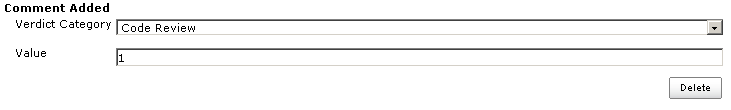
_Comment added configuration._

Specify what Gerrit project(s) to trigger a build on.

At least one project and branch pattern needs to be specified for a
build to be triggered,and you can specify as many gerrit project to
trigger on as you want.

Start by specifying the name of the Gerrit project in the left hand text
field. +
You can specify the name pattern in three different ways, as provided by
the "Type" drop-down menu.

* *Plain:* The exact name in Gerrit, case sensitive equality.

* *Path:* http://ant.apache.org/manual/dirtasks.html#patterns[ANT style
pattern]. Ex: "***/base/**"

* *RegExp:*
http://docs.oracle.com/javase/6/docs/api/java/util/regex/Pattern.html[Regular
expression].

Then provide the name of the branch(es) to trigger on. The same "pattern
types" is available as above. +
So for example to trigger on all branches in the project you can
specify: +
  Type: Path +
  Pattern: ** +
You can add more branch patterns by clicking on "Add Branch" and more
projects by clicking "Add Project".

The same syntax works for specifying which file(s) to trigger on (this
is only available in version 2.3 or higher of Gerrit).

==== Dynamic triggering

From version 2.6.0 of the plugin, a new way of configuring what
projects, branches and files to trigger on is available. +
 
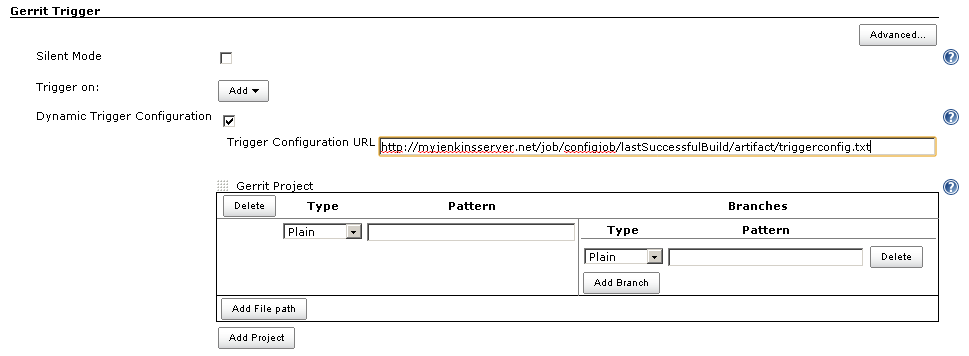
By checking the checkbox "Dynamic Trigger Configuration", the user is
asked for the URL to a file.

On a set interval, the plugin fetches and parses this file. The file
contents should follow this syntax:

[source,syntaxhighlighter-pre]
----
p=some/project
b^**/master/*
f~.*\.txt
p=some/other/project
b^**
----

Explanation:

p for project +
b for branch +
f for file +
= for plain syntax +
^ for ANT style syntax +
~ for regexp syntax

Branch and file lines are assumed to be part of the closest preceding
project line.

The dynamic triggering can be used in combination with the usual
configuration, described above. The gerrit trigger will

trigger both for the dynamic and non-dynamic configurations.

The interval on which Jenkins fetches the file is configurable in the
administrative pages for the Gerrit trigger, under advanced:

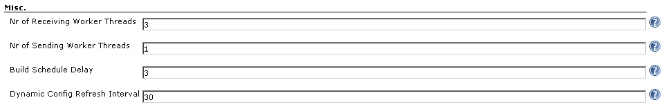

NOTE: Anonymous user must have READ permissions to Jobs in order for
this feature to work.

===== Use case

The reason for this functionality is that a user would want to update a
list of what to trigger on outside of Jenkins.

Another use case is to run a build in Jenkins periodically that creates
the list, then have several projects use the same list.

===== *Gerrit hooks*

Gerrit doesn't use the standard repository hooks.  To do an automatic
update of jenkins on a patch you'll need to add a hook to the top-level
gerrit hook directory ($site_path/hooks).

The equivalent of a git 'post-receive' hook for gerrit is a
'patchset-created' handler.  More info on gerrit hooks can be found
here:

http://gerrit.googlecode.com/svn/documentation/2.1.2/config-hooks.html

=== Usage with the Git Plugin

To get the Git Plugin to download your change; set Refspec to
*$GERRIT_REFSPEC* and the Choosing strategy to *Gerrit Trigger*. This
may be under ''Additional Behaviours/Strategy For Choosing What To
Build' rather than directly visible as depicted in the screenshot. You
may also need to set 'Branches to build' to *$GERRIT_BRANCH.* If this
does not work for you set Refspec to
*refs/changes/*:refs/changes/** and 'Branches to build' to
*$GERRIT_REFSPEC*.

NOTE: Be aware that *$GERRIT_BRANCH* and *$GERRIT_REFSPEC* are not set
in the *Ref Updated* case. If you want to trigger a build, you can set
Refspec and 'Branches to build' to *$GERRIT_REFNAME*.

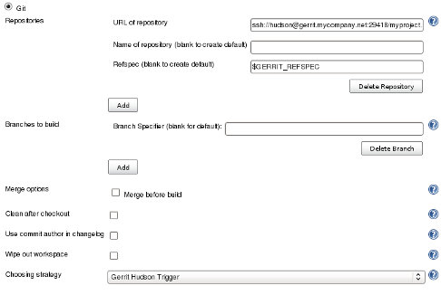

=== Usage with Repo

If you are using a freestyle project and repo to download your code it
would be as "easy" as.

[source,syntaxhighlighter-pre]
----
repo init -u git://gerrit.mycompany.net/mymanifest.git
repo sync
repo download $GERRIT_PROJECT $GERRIT_CHANGE_NUMBER/$GERRIT_PATCHSET_NUMBER
----

=== Missed Events Playback Feature (Available from v. 2.14.0)

NOTE: This feature replaces the "Check Non-Reviewed Patchsets" option that was
part of a Job's Gerrit Trigger configuration.

If your Jenkins instance has been down for a period of time (upgrade or
maintenance), the Missed Events Playback Feature ensures that any missed
events are re-played and builds are triggered.

The mechanics are as follows:

* The Playback Manager maintains a last known alive timestamp of events
that were received by the Gerrit Server connection.
* Upon re-connect, a request is made to the Gerrit Events-Log plugin
installed on the Gerrit Server to determine which events may have been
missed while the connection was down.
* The events are then added to the Gerrit Trigger event queue to be
processed.

==== Setup Requirements

The Playback Manager requires:

* The REST api to be configured for the Gerrit Server Connection.
* The Gerrit Events-log plugin must be installed on the Gerrit Server
(Please see https://gerrit.googlesource.com/plugins/events-log/)

===== Setting up the REST api

* To setup the REST api for the Gerrit Server Connection, navigate to
*Manage Jenkins > Gerrit Trigger* and click on the *Edit* icon for the
Server Connection.
* Click on *Advanced*, and enter the *Gerrit HTTP User* and *Gerrit HTTP
Password* values as shown below.

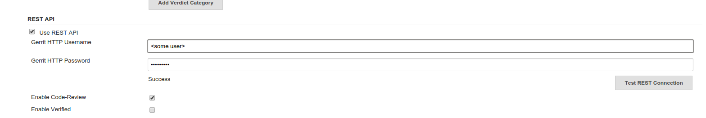

* Click on *Test REST Connection* to verify the user and password
settings.
* Click on *Save*
* Restart the connection using the *Status* icon in the Server Table
shown below:

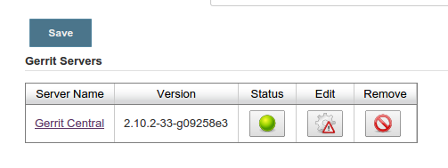

===== Gerrit Server Events-Log plugin

Gerrit Server Events-Log plugin

NOTE: Please note that if the Gerrit Server Events-Log plugin is not installed
on the *Gerrit Server*, then the Playback Manager will be disabled.

* Please see https://gerrit.googlesource.com/plugins/events-log/ for
installation details.

==== Verifying functionality

* Once you have restarted the connection, click on the *Edit* icon in
the Server Table. If there is a problem with the Playback Manager's
configuration, you will see this:

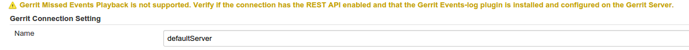

* If the Playback Manager is correctly setup, you will see the following
in the Jenkins log file when the Gerrit Server Connection is started:

[source,syntaxhighlighter-pre]
----
INFO: (8) missed events to process for server: defaultServer ...
----

== Skip Vote

"Skipping" the vote means that if more than one build is triggered by a
Gerrit event the outcome of this build that "skips its vote" won't be
counted when the final vote is sent to Gerrit. If this is the only build
that is triggered then the vote will be 0.

This can be useful if you have one job that triggers on all patch set
created events that just checks that the commit message is correctly
formatted, so it should only deny merging if it is a bad commit message
but also not allow the merge just because the message was ok. In that
scenario you could configure the "check commit message" job to skip
voting on Successful.

== Additional Screenshots

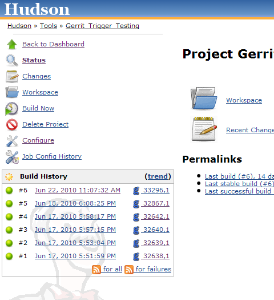
  
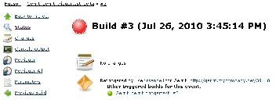
  
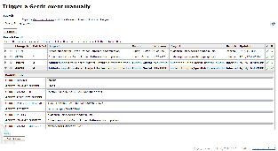

== Pipeline Jobs

Version 2.15.0 of the Gerrit Trigger plugin supports Jenkins Pipeline
job types. So as with the traditional job types, this plugin supports:

. Triggering of Pipeline Jobs based on Gerrit Event notifications e.g.
the Patchset Created event.
. Checkout of the change-set revision from the Gerrit Git repository.
See example below.
. Sending of the "build completed" command to Gerrit (with Verified
label etc).

The plugin doesn't currently offer a dedicated DSL syntax for performing
the change-set checkout. However, it's very easy to perform the checkout
using the Gerrit parameters provided to the build, along with the
existing Workflow step for Git (or other supported SCM) e.g.

[source,syntaxhighlighter-pre]
----
node {
  // Checkout the Gerrit git repository using the existing
  // workflow git step...
  git url: '<gerrit-git-repo-url>'

  // Fetch the changeset to a local branch using the build parameters provided to the
  // build by the Gerrit plugin...
  def changeBranch = "change-${GERRIT_CHANGE_NUMBER}-${GERRIT_PATCHSET_NUMBER}"
  sh "git fetch origin ${GERRIT_REFSPEC}:${changeBranch}"
  sh "git checkout ${changeBranch}"

  // Build the changeset rev source etc...
}
----

Note though that with this approach the changelog will not show
correctly.

== Tips & Tricks

This section contains some useful tips and tricks that users has come up
with. Feel free to add your own.

=== Using "Build Now"

Normally when you have configured a job to be triggered by Gerrit you
can't use the "Build Now" link anymore since your builds are dependent
on information from Gerrit, especially if you are using the Git plugin
to checkout your code in the workspace.

You can get around this limitation if you for example want to use the
same job to build the master branch at some point. If you are using the
Git plugin do the following

[source,syntaxhighlighter-pre]
----
Add a String parameter called GERRIT_REFSPEC with the default value refs/heads/master
----

Using this trick will enable you to build, but no results will be sent
to Gerrit since it is not triggered by it.

=== Multiple jobs review the same changeset (possibly giving different answers)

That's possible, see
http://strongspace.com/rtyler/public/gerrit-jenkins-notes.pdf

=== Reduce number of notification emails

Since the trigger adds a comment in Gerrit for each build start and end,
usually all the reviewers get a notification email. This can get quite
annoying. However, it's possible to configure Gerrit so that only the
change owner and people who starred the change get a notification email.
To do this DENY the 'Email Reviewers' capability for the Gerrit user
that is used by Jenkins. See
https://gerrit-review.googlesource.com/Documentation/access-control.html#capability_emailReviewers.

=== Note to Gerrit > 2.6 Users

The verdict category key values has changed in 2.6 from CDRV, VRIF to
Code-Review and Verified. So in order to be able to trigger on comment
added you need to change the settings on the "Manage Jenkins/Gerrit
Trigger" page (it's hidden behind the advanced button) and reconfigure
all your jobs so they can pick up the new values.

Also note that the Verified flag is no longer in Gerrit by default,
see http://gerrit-documentation.googlecode.com/svn/Documentation/2.6/cmd-review.html so
you'll need to add it to Gerrit for new installs.  This can
http://blog.bruin.sg/2013/04/how-to-edit-the-project-config-for-all-projects-in-gerrit/[easily
be added back to all projects].  Otherwise the Gerrit Trigger will fail
to submit votes for jobs, due to the invalid label.

Alternately, you can remove the verified flag from the command used to
submit votes for changes, and simply have the trigger submit code review
votes:

. Go to "Manage Jenkins" and click the "Gerrit Trigger" link
. Under "Gerrit Servers" next to your server(s) click the "Edit" button
(looks like a gear, other icons may overlap it)
. Under "Gerrit Reporting Values" click the Advanced button at the
bottom
. Under "Gerrit Verified Commands" remove the '--verified <VERIFIED>'
sections from each command, see screenshot

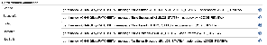

As of version 2.17.0 the verified "vote" is not sent at all to Gerrit
_(removed from the command line/rest call)_ unless there is an actual
value to be sent. So if you change the configuration to contain only
values for code review and empty strings for verified you won't get the
error.

== Change Log

New releases are logged in https://github.com/jenkinsci/gerrit-trigger-plugin/releases[GitHub Releases].

Releases from 2.30.0 and older are archived in link:CHANGELOG.old.adoc[CHANGELOG.old.adoc]

